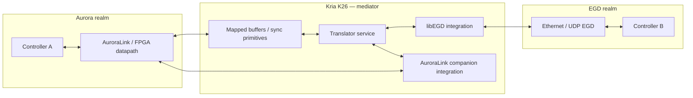

# Protocol Translator: AuroraLink ↔ Ethernet Global Data (EGD)

Technical documentation for a **bidirectional mediator** running on AMD Xilinx **Kria K26 Robotics** stacks. The mediator connects a domain that speaks **Xilinx Aurora (AuroraLink serial transport)** with a domain that speaks **Ethernet Global Data (EGD)** over UDP.

For the EMS-oriented design intent (layers, producer/consumer model, buffer states, success criteria), see **[DESIGN_INTENT.md](DESIGN_INTENT.md)**.

For **Kria + AuroraLink (PL) ↔ libEGD**, mediation layer boundaries, and the **push vs pull** investigation frame, see **[docs/BRIDGE_SOFTWARE_DESIGN.md](docs/BRIDGE_SOFTWARE_DESIGN.md)**.

---

## 1. Problem space

### 1.1 Scenario

Assume **two autonomous controllers**:

| Endpoint | Medium / stack | Responsibility |
| -------- | ------------- | ---------------- |
| **Controller A** | FPGA-backed **AuroraLink** serial link | High-bandwidth streaming I/O framed by Xilinx Aurora cores; companion software on the embedded host (typically PS-side Linux or RTOS bare-metal helpers) configures and moves data blocks to/from FPGA interfaces. |
| **Controller B** | **EGD over Ethernet** | Industrial/process-style **Ethernet Global Data** UDP exchanges (“pages” / production messages). |

Neither controller understands the peer’s framing natively. A **protocol translator**:

- **Ingests** structured data from AuroraLink companion interfaces (typically memory-mapped FPGA regions, scatter-gather FIFOs, DMA paths, or dedicated driver APIs—not re-implementing Aurora on the ARM core).
- **Maps** semantics (fields, endianness, alignment, versioning) onto EGD payloads and identifiers (exchange IDs, producer IDs, PDU layout).
- **Performs the inverse path** when EGD is the stimulus: receive / validate EGD packets, unpack, translate, and emit toward the FPGA / Aurora-facing path.

The relationship is inherently **bidirectional**: traffic may be driven Aurora→EGD, EGD→Aurora, or both concurrently, depending on the application scheduling model.



### 1.2 Out of scope versus in scope for this mediator

**In scope:**

- Temporal ordering, jitter management, buffering, mapping tables, lifecycle of exchange IDs, watchdogs, and bridging between FPGA exposed interfaces and the EGD UDP stack (`libEGD` or aligned custom encoders/decoders aligned with GE EGD 2.x semantics).

**Out of scope (handled by Xilinx IP/tools):**

- CRC, scrambling, comma alignment, and serial lane specifics of Aurora on the FPGA—those belong to hardened cores and Xilinx design flows (see Xilinx documentation such as Aurora 64b/66b / Aurora 8b/10b product guides referenced from the official Xilinx site and design hubs).

Primary reference collateral in this workspace today:

- **`libEGD-master/`** — C/C++ oriented EGD implementation with CMake, Docker build, JsonClient (recommended ergonomics), and raw `EgdClient` for latency-sensitive paths (`libEGD-master/README.md`).
- **`EgdSend.c` / `EgdTest.h`** — Minimal POSIX example of **EGD Data Production** messages (PDU type 13, default UDP port **18246**, payload cap **1400** bytes in these headers), useful for conformance testing against the mediator.
- **Kria CHIL documentation** (`Kria CHIL Documentation.docx` in repo snapshot) — use for robotics-specific BSP, networking, device tree / boot, and Xilinx runtime expectations on Kria robotics SKUs where applicable.

External references to wire into the design bibliography:

- Xilinx **Aurora** serial protocol cores and FPGA integration flows.
- Xilinx **Zynq Ultrascale+ MPSOC** PS–PL partitioning (interrupts, AXI throughput, QoS)—relevant whenever Aurora DMA or stream interfaces cross into PS memory.
- **EGD specification** cited by upstream `libEGD` upstream project (Ethernet Global Data, typically GE industrial automation lineage).

---

## 2. Target platform constraint: Kria K26 robotics

The mediator must operate **deterministically enough** on the Robotics stack—often **Ubuntu on the PS**, sometimes with preemptible kernels or partitioned real-time workloads and PL accelerators adjacent to deterministic I/O paths.

Concrete engineering constraints commonly encountered:

| Concern | Implication |
| ------- | ----------- |
| **PS vs PL separation** | Aurora frames usually terminate **in programmable logic**. Translation logic that runs on ARM must treat PL data paths as authoritative for line-rate payloads; copying into PS RAM should be minimized or pipelined. |
| **Cache coherency** | Non-coherent FPGA→PS mappings require explicit invalidate/flush policies when sharing buffers across DMA and CPU translators. Wrong cache policy yields stale payloads or tearing. |
| **Interrupt load** | EGD ingestion from Ethernet can saturate soft interrupt budget if polled naively—pin thread affinity, NIC tuning (ring sizes, offload flags), socket buffer caps. |
| **Determinism** | Industrial bridges often impose **worst-case latency budgets** tighter than averages. Translator design must quantify both paths independently and **under loaded link conditions**. |
| **Operational packaging** | Robotic SKUs emphasize clean services (systemd), logging, rollback, reproducible BSP images; translate process should fail closed (signals + telemetry) rather than deadlock silently when one side stalls. |

These constraints materially influence buffering depth, wakeup sources, CPU affinity placement, whether `libEGD::JsonClient` vs raw APIs are appropriate, and how tightly coupled the Aurora-facing thread is with any PL interrupt.

---

## 3. Architectural strategy

Two complementary integration patterns can coexist depending on FPGA floorplan maturity:

### 3.1 Path A — PS-centric bridging (bring-up friendly)

Ideal when Aurora companion driver libraries expose coherent memory windows or POSIX-like file semantics for FPGA FIFOs:

1. **EGD ingress thread** wakes on NIC activity or timers, calls `libEGD` subscriber APIs (`JsonClient` or raw `EgdClient`).
2. **Marshalling layer** maps JSON or raw byte pages into application structs and copies into **outbound Aurora staging buffers** (or issues driver ioctls / write() calls when available).
3. **Aurora egress thread** or callback signals completion upward when FPGA watermark / interrupt indicates egress credit.

### 3.2 Path B — PL-assisted streaming (latency sensitive)

Adds PL-side shallow FIFOs plus optional width adapters / packers feeding PS RAM through AXI FIFO or datamovers; PS tasks only handle **scheduled bulk moves** aligned to hardware events (watermark IRQs).

This pattern reduces jitter by avoiding full CPU pacing for every FPGA word but increases verification complexity across clock domains.

### 3.3 Software layering

Suggested logical modules on the mediator:

| Layer | Responsibility |
| ----- | ------------- |
| **Transport adapters** | `libEGD` client stack (UDP/socket config, JSON schema / raw layout), FPGA driver façade for Aurora datapath ingestion & emission hooks. |
| **Translation core** | Field mapping tables, versioning, endianness, scaling, coercion, saturation, telemetry on translation errors. |
| **Synchronization & scheduling glue** | Triggers tying Aurora frame boundaries to EGD production cycles—or vice versa. |
| **Supervision / observability** | Heartbeats, Prometheus-style counters, PCAP toggle for UDP debug, FPGA link status surfaces. |

---

## 4. Design decisions & trade-offs

### 4.1 Synchronization

**Goals:** Maintain causality boundaries that both sides understand (no partial interpretations), avoid starvation on either ingress, reconcile clock domains (Ethernet host time vs FPGA local cycles).

Baseline strategies:

| Mode | Traits | Fits when |
| ---- | ------ | --------- |
| **Periodic master clock** | One side (typically EGD production periodicity) dictates translation cadence. | Stable industrial publish rates; FPGA path can tolerate small elastic backlog. |
| **Event-triggered dominant** | Frame arrival on Aurora or PDU arrival on UDP triggers synchronous translation bursts. | Bursty payloads; deterministic reaction to arrivals matters more than jitter smoothing. |
| **Hybrid phased loop** | Small PLL-like adjustment of pacing so long-term averages match while allowing instantaneous elasticity. | Mixed determinism tiers; bridging cyclical robotics tasks with stochastic Ethernet arrivals. |

**Cross-boundary timestamps:** Populate EGD timestamps (`timespec`-like fields mapped in structures such as those under `EGD_Time` constructs in companion sample headers—see repo `EgdTest.h`). Compare against PS monotonic clocks and PL cycle counters deliberately; ambiguity here causes diagnosing “late” alarms extremely painful.

Document one **authoritative time base** internally and annotate translations with both **ingress receive time** and **translation commit time**.

### 4.2 Buffering

Driving questions:

| Question | Operational impact |
| -------- | -------------------- |
| **Single vs multi-buffer handshake** | Double/triple buffering isolates translators from FPGA DMA catch-up bursts; naive single-frame ping-pong invites tearing during concurrent read/write bursts. |
| **Queue depth sizing** | Use peak burst length + maximum translation latency + jitter margin. Oversized queues hide faults; undersized queues drop frames under innocuous jitter. |

EGD payloads in bundled sample material cap usable application field space around **1400 bytes** beneath headers (`EGD_MAX_DATA_SIZE` macro in repo example header). Larger semantic graphs must shard across exchanges or negotiate multiple pages upstream.

**Stale data handling:** Decide policy when downstream consumer is slower:

- Prefer **discard-old** semantics for actuator safety (always newest command wins), or  
- Prefer **consume-all queued** semantics for journaling / analytics (never silently drop)—but beware latency blowups.

State that policy explicitly in integration contracts with both OEM teams.

### 4.3 Triggers (what wakes the translator)

Potential wakeup sources intersect:

| Trigger | Typical mechanism | Risks |
| ------- | ----------------- | ------ |
| **UDP datagram readiness** (`poll`/`epoll`, `recvmsg`) | Standard socket readiness | CPU overhead if pacing mis-tuned |
| **Aurora / PL interrupt** signaling frame boundary | ISR → lightweight enqueue + kick worker thread | Must keep ISR ultralight |
| **Clock tick / timerfd** aligning EGD publishes | Periodic `timerfd`/`clock_nanosleep` ABS patterns (see pacing style in bundled `EgdSend.c`) | Potential drift versus bursty FPGA input |
| **Application explicit command token** coordinating multi-axis moves | Mailbox / shm event | Complexity of orchestration spikes |

Operational guidance:

- Isolate **heavy translation** outside ISRs inside **bounded priority threads** pinned away from housekeeping cores when possible on Kria Robotics images.
- For bidirectional bridging, classify threads into **producer-of-record** lanes and avoid priority inversion crossing semaphores without timeout diagnostics.

Example scheduling sketch (pseudo):

```
Thread EGD_In: blocked on UDP + timer slack
Thread FPGA_In: blocked on FPGA eventfd / IOCTL read
Translator core: signaled when either ingress queue crosses commit threshold OR timer fires (whichever earliest policy demands)
Aggregator/publisher: aligns outputs to pacing contract
```

### 4.4 Failure & safety envelopes

Operational reliability requires explicit policies on:

| Condition | Translator behavior |
| --------- | -------------------- |
| Aurora link LOS / invalid framing | Freeze / zero safe outputs upstream; escalate fault bit to EGD status fields when representable (`EGD_STATUS_*` enums in bundled sample header). |
| EGD malformed PDU | Discard + statistic counter; optionally publish diagnostic exchange if allowed in plant security policy. |
| Memory pressure (`ENOBUFS`, socket backlog) | Rate-limit logging; escalate supervisor event; maintain last-known-good shadow struct with TTL. |

Document **cold start ordering** (`link must be validated before actuator enabling frames propagate`).

---

## 5. Data mapping lifecycle

Stages for each translation direction remain symmetric:

1. **Discover** authoritative schema/version handshake (explicit config file shipped with Robotics image vs runtime discovery handshake).
2. **Bind** FPGA memory windows + EGD Producer/Exchange IDs (+ optional JSON schemas if using JsonClient ergonomics upstream).
3. **Validate first frames** golden patterns / loopback harness (PCAP + hardware loopback coaxial / SFP BER testing when applicable).
4. **Operate continuous** supervising latency histograms separately for **A→E** and **E→A**.
5. **Upgrade** versioning—never rewrite live mapping tables without phased shadow activation.

Maintain **machine-readable map artifacts** (`yaml`/`json`/generated headers) consumed by translator build to minimize documentation drift versus runtime binary mismatches.

---

## 6. Implementation pointers using repository artifacts

### 6.1 EGD prototyping

`EgdSend.c` constructs **Data Production** frames on Linux with jitter/tracing scaffolding (monotonic pacing). Use initially to:

- Sanity check UDP multicast/unicast reachability (`DEFAULT_DESTINATION` patterns).
- Observe interplay between pacing timer strategy and jitter statistics before embedding into multi-thread mediator.

The `libEGD-master/` sources are tracked in-repo; integrate C++ mediator services from that tree directly. Prefer **JSON client** pathways unless absolute raw timing demands direct `EgdClient` pipelines.

### 6.2 Aurora companion integration placeholder

Upstream Aurora IP plus SW stack dictates exact driver entry points (`open`, mmap, IOCTL, Xilinx kernel modules, XRT when applicable—not assumed here).

Document **chosen hook points** explicitly once BSP integration is instantiated (interrupt numbers, mmap base addresses).

---

## 7. Verification matrix (minimum credible)

| Test | Acceptance signal |
| ---- | ----------------- |
| EGD conformance loopback | PCAP shows correct PDUs sized within negotiated limits; timestamps monotonic modulo policy. |
| Aurora stress | PRBS / Xilinx serial link BER OK; FPGA interrupt storm does not deadlock translator watchdog. |
| Bidirectional concurrency | Elevated ingress on side A concurrently with bursts on side B yields zero cross-path priority inversion starvation > budget. |
| Failure injection | Simulate UDP starvation & link drop; validate safe degraded mode & recovery without requiring full board reset. |

Record results in robotics integration release notes referencing image tag + FPGA bitstream hash.

---

## 8. Open engineering questions (prioritized backlog)

1. Authoritative pacing master for **each operational mode** (`robot teach` vs `autonomous`).
2. Endianness guarantees across PS copies vs PL DMA—generate compile-time asserts for struct packing.
3. Security posture: segment EGD VLAN; restrict multicast membership; authenticate configuration pushes.
4. Observability exporter format (Counters vs tracepoints) aligning with customer's SCADA ingestion.

---

## 9. Glossary & abbreviations

| Term | Meaning |
| ---- | ------- |
| **Aurora / AuroraLink** | Xilinx FPGA high-speed serialized channel protocol suite; FPGA-resident datapath—not reimplemented on purely PS software. |
| **EGD** | Ethernet Global Data UDP industrial exchange pattern (production / consumption semantics). |
| **PS / PL** | Processing System / Programmable Logic (Zynq Ultrascale+ architecture). |
| **CHIL / KRIA stack** | Contextual Xilinx robotics platform packaging (BSP, networking, peripherals). |

---

## 10. Repository layout snapshot (conceptual anchor)

Primary inputs today:

```
EgdSend.c / EgdTest.h        — Minimal EGD emission & header definitions
libEGD-master/               — Full-featured structured EGD implementation (sources)
Kria CHIL Documentation.docx — Platform-specific operational guidance
(EgdSend)                    — Prebuilt aarch64 Linux sample binary artifact
```

Maintain this document beside evolving translator source once native build trees land (planned next milestone).

---

*Document revision: synthesized from customer exercise brief + checked-in collateral. Update FPGA hook naming, interrupt indices, VLAN IDs, Exchange ID tables, performance budgets, and selected libEGD API pathway after engineering decisions firm up.*
